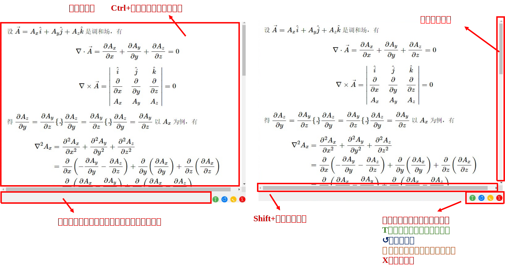
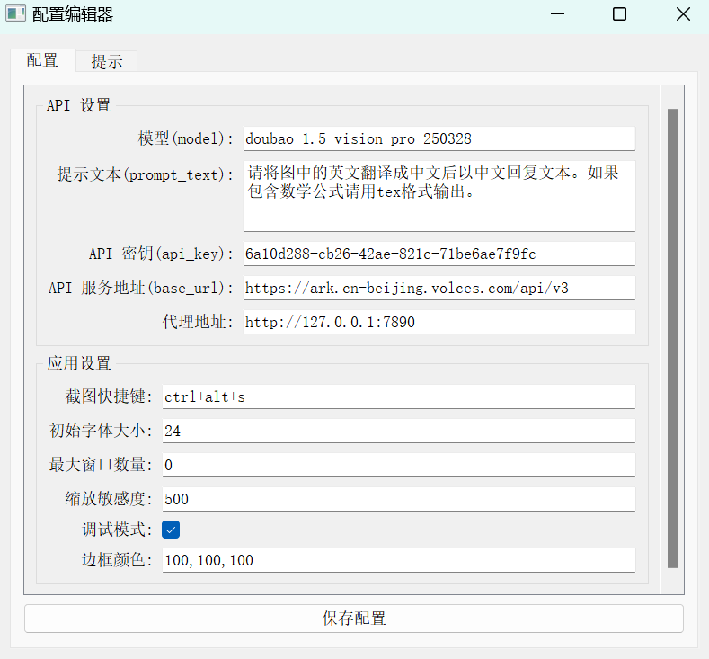
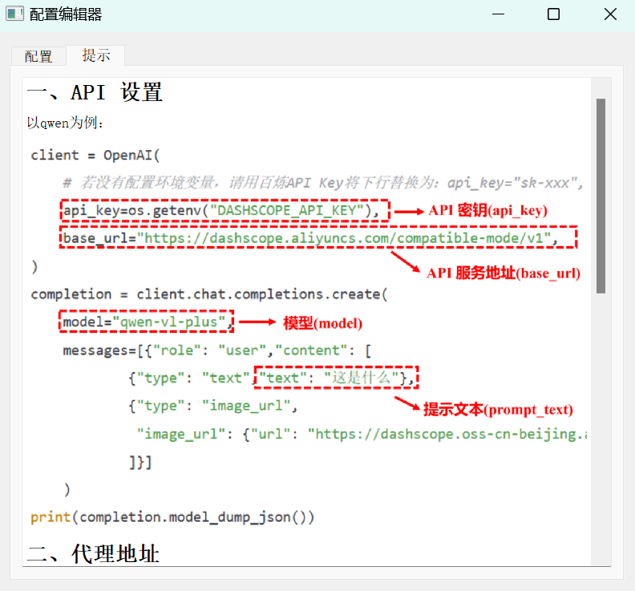

# AI 截图翻译工具 (AI Screenshot Translator)

[](https://www.python.org/downloads/) [](https://nuitka.net/) [](https://github.com/Diraw/AI-Screenshot-Translator/releases/tag/v0.3.5)

# 简介

本工具通过**简单的截图操作**，将图片发送给 AI 模型进行文本识别和翻译，并将翻译结果以可交互的 HTML 格式显示在独立的窗口中。

本工具支持**自定义快捷键触发、多窗口结果管理以及系统托盘运行**，极大提升了日常工作和学习中的翻译效率。

**工具特点**：1、截图翻译，快捷键启动；2、贴片截图和翻译，可随意拖动、缩放，可创建多组翻译贴片；3、公式可以切换原始文本方便复制；4、自定义api接口

**想要解决的痛点**：1、目前市面上主流的整篇文档翻译的臃肿；2、若选择pdf复制文本粘贴翻译，有时候公式块是乱的或者无法复制到；3、对于图像扫描的pdf，无法复制文本

# v0.3.5强力更新🚀

- 新增**配置热加载**功能。现在对配置文件点击“保存配置”，修改会立刻更新应用，不需要再重启了！
- 新增**窗口软关闭**功能。现在不小心关闭截图窗口或者翻译窗口，可以点击另外一个窗口左下角蓝色的“R”键还原！
- 修复了若干bug

# 演示


# 窗口展示

翻译窗口：



配置窗口：

<table>
  <tr>
    <td></td>
    <td></td>
  </tr>
</table>

对于配置选项更加详细的介绍可在软件内部或者网页查看 [提示](./doc/hint.md)

# 安装

您可以选择下载源码运行，或者前往 [Releases](https://github.com/Diraw/AI-Screenshot-Translator/releases) 界面下载可执行文件

### 1. 克隆仓库

```bash
git clone https://github.com/Diraw/AI-Screenshot-Translator.git
cd AI-Screenshot-Translator/src
```

### 2. 创建虚拟环境并运行

```bash
conda create -n AI-Translator python=3.8
conda activate AI-Translator
pip install -r requirements.txt
python main.py
```

# 更新计划

- ~~新增api配置的gui窗口，优化手动配置yaml文件的逻辑为软件自动生成（v0.3.0已完成）~~
- 新增图片和公式储存系统，方便后期调用（预计v0.4完成）
- （更多功能欢迎issue提出或PR贡献）

# 其他

- 软件icon来自 [iconfinder](https://www.iconfinder.com/search?q=screenshot&price=free)
- 喜欢本项目不妨点个star支持一下

[](https://www.star-history.com/#Diraw/AI-Screenshot-Translator&Date)